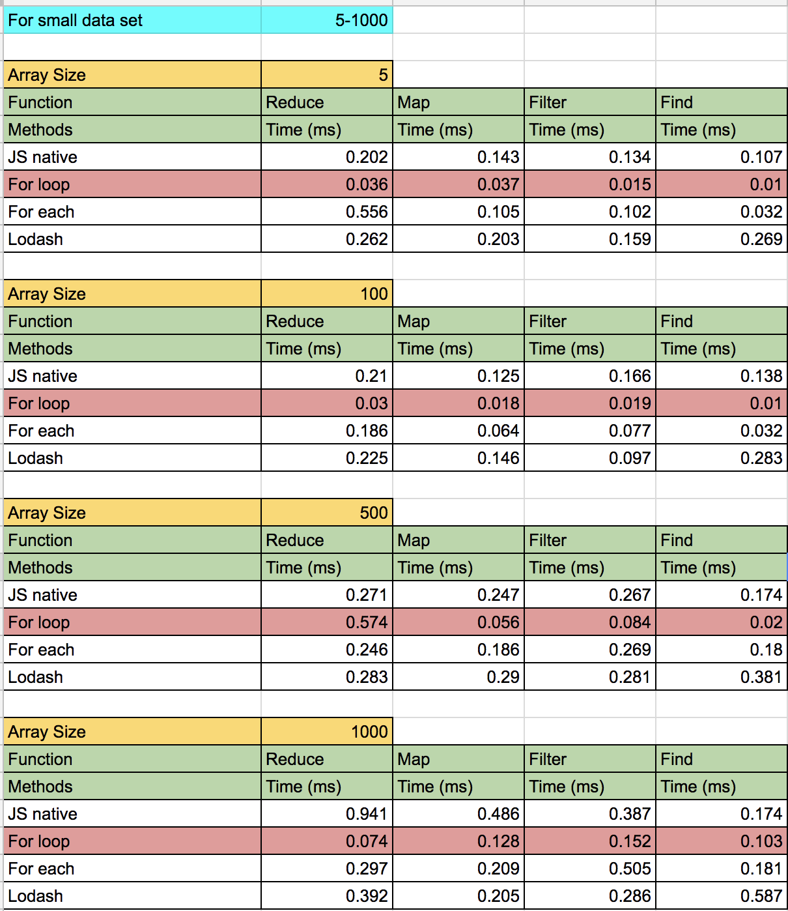
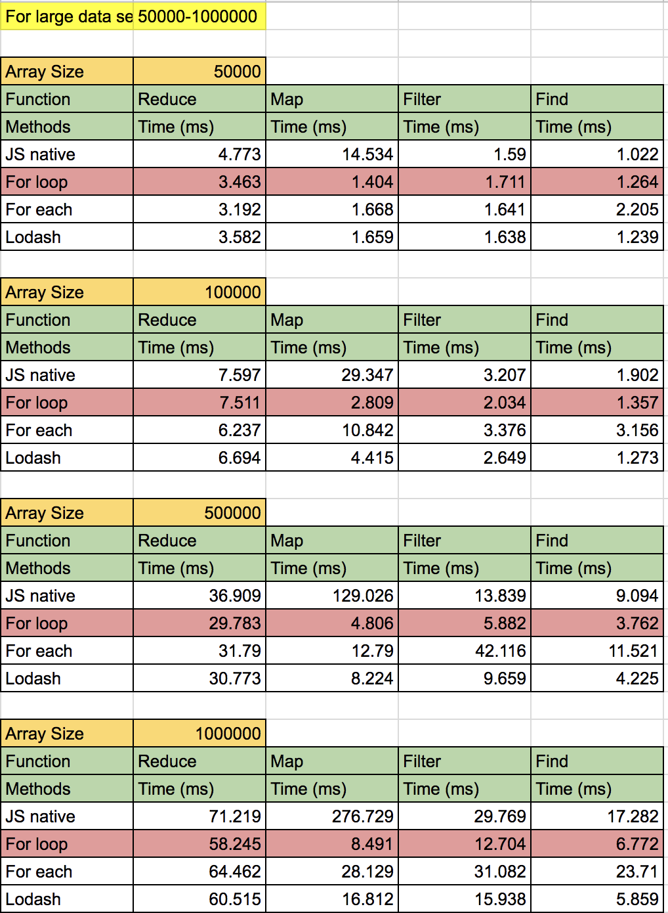

# Performance-Analysis
Comparing native JavaScript array methods map, reduce, filter, and find against for loop, forEach loop, lodash, and ramda methods. The analysis uses basic operations and heavy data manipulation to analyze the execution speed of each method.

## Note: These results are from tests using practical real world scenario's i.e how we write js on a daily basis rather than the writing the best optimized code / better techinque of execution, etc.

### To run 
 1. Run `npm install`
 2. Generate the [data](data.js) for the tests by running `npm run seed`. 
    - The default array is 10000 elements in length. You can create an array of a custom length by passing the desired size as an arugment, like so `npm run seed 100000`.
 2. For a small data set performance report run `npm run t:s`. 
    - This runs the analysis on the first 5 elements of the array.
 4. For a performance report on the whole array run `npm run t:l`
 5. For Warm cache result use `npm run c:r 5`, here 5 is the size of array.
 
 To test your own function create them in the [formulas.js](formulas.js) file.
    
### Results for small data set of array size 5 - 1000 

### Results for mid data set of array size 3000 - 20000

### Results for large data set of array size 50000 - 1000000

### Coming soon
1. `process.hrtime()` for node.js instead of `console.time`
2. `for..of` and `for..in` comparisons
3. Complexity of degree 2 formulas, i.e n^2, and their comparision.
4. Better optimization technique to write fast javascript loop code
5. `jsPerf` — link for all formulas as test cases.

### Note
1. These results are computed using Node V8 v5.8.283.41
2. These results consider inline caching, warm cache, and some of GC stuff.
3. These results do not consider optimized code and hidden classes.
4. Results may vary as per env's.

### Discussion/Posts
1. [https://news.ycombinator.com/item?id=17050798](https://news.ycombinator.com/item?id=17050798)
2. [https://medium.com/@ideepak.jsd/javascript-performance-test-for-vs-for-each-vs-map-reduce-filter-find-32c1113f19d7](https://medium.com/@ideepak.jsd/javascript-performance-test-for-vs-for-each-vs-map-reduce-filter-find-32c1113f19d7)

